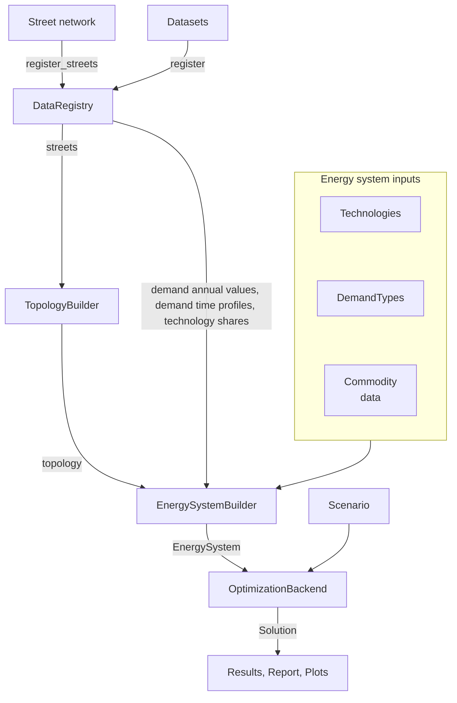

# README
## GeoPipe

**Geo**graphical energy system modeling data **pipe**line

> [!WARNING]  
> This repo currently is under development and the API is not stable yet. Please contact us if you want to use it in your research.

## Installation
### Using CESM 
Using the [Compact Energy System Modeling Tool](https://github.com/EINS-TUDa/CESM) as backend for the energy system optimization. Requires Gurobi.
```bash
pip install "geopipe[cesm]"
pip install git+https://github.com/EINS-TUDa/CESM.git@578e0bb
```


### Using other optimization frameworks
```bash
tbd
```

## What `geopipe` does
`geopipe` is an automated, open-source data processing pipeline that transforms geospatial data on energy demand and supply and techno-economic data into a structured energy system representation. The structured energy system representation can be passed to modern multi investment energy system models via lightweight Python interfaces. Detailed documentation can be found [here](https://eins-tuda.github.io/geopipe).

The most important concepts are:


See
[`examples/test_case_bensheim/bensheim_test_main.py`](https://github.com/EINS-TUDa/geopipe/blob/main/examples/test_case_bensheim/bensheim_test_main.py)
for an end-to-end reference.


## Contribution
Clone the repo and run
```bash
uv sync
```
to set up the development environment.

## Contact
Carolin Ayasse, [carolin.ayasse@eins.tu-darmstadt.de](mailto:carolin.ayasse@eins.tu-darmstadt.de)

[Energy Information Networks and Systems (EINS)](https://www.eins.tu-darmstadt.de) at Technical University of Darmstadt, Germany


