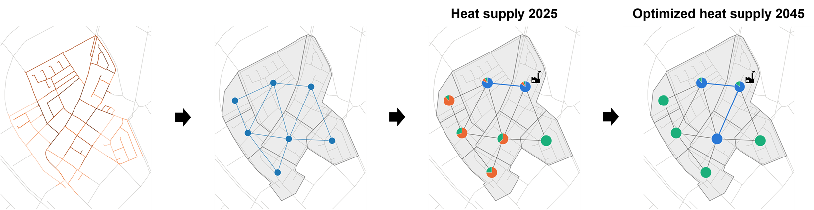
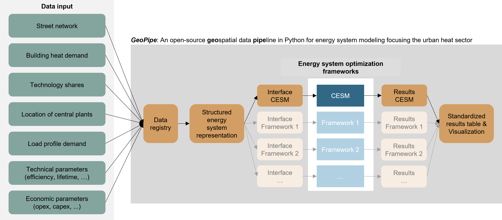
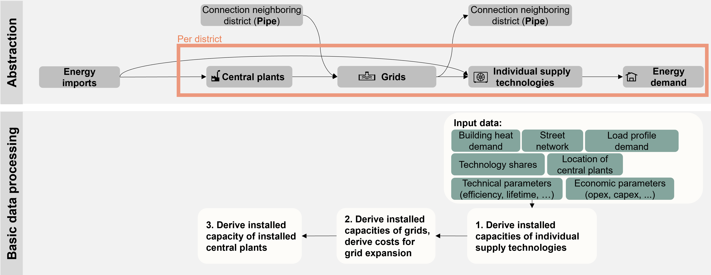
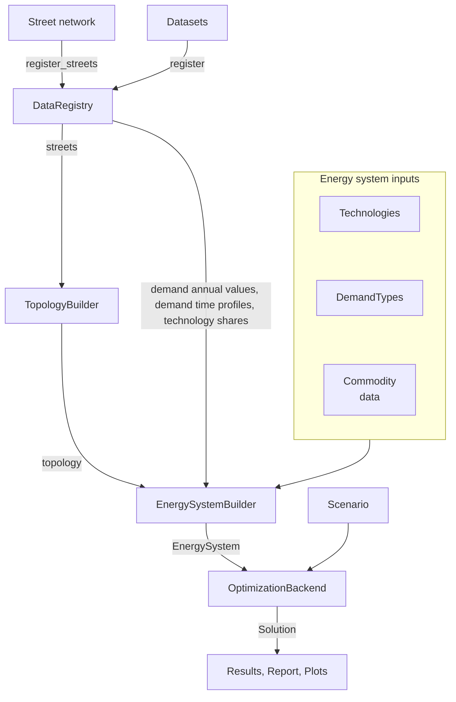

# Welcome

**GeoPipe — *Geo*graphical energy system modeling data *pipe*line**

GeoPipe is an automated, open-source data processing pipeline that transforms geospatial data on energy demand and supply and 
techno-economic data into a structured energy system representation. The structured energy system representation
can be passed to modern multi investment energy system models via lightweight Python interfaces. 

## Structured Representation of Energy System

## Concept

See
[`examples/test_case_bensheim/bensheim_test_main.py`](https://github.com/EINS-TUDa/geopipe/blob/main/examples/test_case_bensheim/bensheim_test_main.py)
for an end-to-end reference.

## Where to start

- New to the project? [Install GeoPipe](installation.md),
  then follow the diagram top-to-bottom — each box is one step in the
  example script.
- Found a bug or want to contribute? Open an issue or pull request on
  [GitHub](https://github.com/EINS-TUDa/geopipe).

